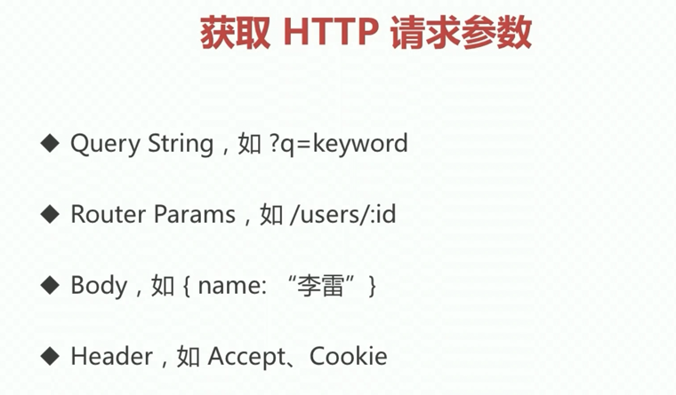
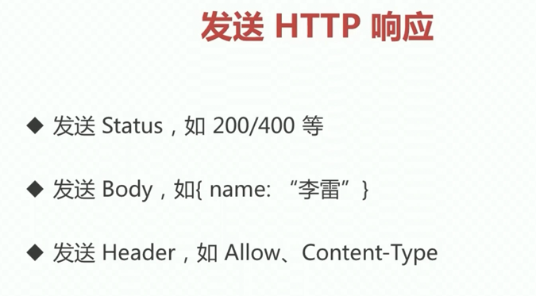

## 流程

```txt
mongoose=>schema=>xxx.yyy 查库
koa-router,mounted at app.js

```

## ctx instrument

### request

```js

-get

ctx.request.query

- post

ctx.request.body
```




### response

```js

ctx.body = 'xx'
```




## mongoose

### 定义model

https://mongoosejs.com/docs/guide.html

## koa-router

### app.js

```js

const router = require('koa-router')()
const users = require('./routes/users')

router.prefix('/api')
app.use(router.routes(), router.allowedMethods())
router.use(users.routes(), users.allowedMethods())

```

上面是一种，需要都加 prefix 的 如果不用加 prefix ，可以：

```js
const users = require('./routes/users')

router.use(users.routes(), users.allowedMethods())
```

### user.js

```js
const router = require('koa-router')()  //router
const Users = require('../models/userSchema') //schema

router.prefix('/users')

router.post('/xx', async (ctx, next) => {
    const res = await Users.xxx
})

module.exports = router

```

### schema (mongoose)

```js

const mongoose = require('mongoose')

const userSchema = new mongoose.Schema({})

module.exports = mongoose.model('users', userSchema)

```

## pwd

https://www.npmjs.com/package/jsonwebtoken

## mongoose返回数据库指定字段 请列举所有的实现方式

Mongoose 提供了多种方式来返回数据库中的指定字段。以下是一些实现方式：

1. **使用 `.select()` 方法**：这是最常见的方式，通过 `.select()` 方法来指定要返回的字段。你可以将要返回的字段列为字符串，以逗号分隔，也可以使用对象形式。

   ```javascript
   // 返回 'username' 和 'email' 字段
   User.find().select('username email').exec();
   
   // 使用对象形式选择字段
   User.find().select({ username: 1, email: 1 }).exec();
   ```

2. **使用 `.lean()` 方法**：`.lean()` 方法将查询结果转换为 JavaScript 对象，而不是 Mongoose 文档。这样你可以使用普通 JavaScript 对象来选择要返回的字段。

   ```javascript
   User.find().lean().select('username email').exec();
   ```

3. **使用投影字段**：在查询时，可以传递一个对象，其中只包含要返回的字段。这称为投影字段。

   ```javascript
   User.find({}, { username: 1, email: 1 }).exec();
   ```

4. **使用 Schema 的 `select` 属性**：你可以在定义模式时，为每个字段设置 `select` 属性，以指定是否在默认情况下选择该字段。

   ```javascript
   const userSchema = new mongoose.Schema({
     username: { type: String, select: true },
     email: { type: String, select: true },
   });
   ```

   在这种情况下，当你执行查询时，这些字段将默认被选择。

这些方式提供了不同的灵活性和场景下的选择。你可以根据你的具体需求选择适合你的方法。通常情况下，使用 `.select()` 是最常见的方式，因为它可以轻松指定要返回的字段。

### answer 2:
```txt
   返回数据库指定字段有三种方式：
   1. 'userId userName userEmail'
   2. {userId:1, _id:0}
   3. select('userId')
```

## 进度
搞到502 的第11章了，
第11章没搞

